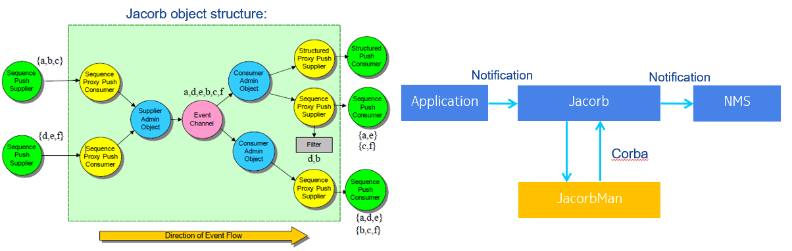

# JacorbMan
A management tool for JacORB server, can used for monitoring, manage, configure online, trouble shooting, test JacORB server.



## Background
OMG [CORBA](http://www.omg.org/) is a standard for distributed objects, it is a widely used architecture. 
[JacORB](https://github.com/JacORB/JacORB) is the most used open source Java implement of CORBA.

## Functions
- Show detail internal objects, connections in runtime JacORB service, such as bind names in  naming service, registered event channel and proxies in notification service;
- Manage objects in JacORB service, such as bind/unbind name in naming services, create, remove event channel, admins, proxies in JacORB runtime notification service, without restart;
- Configured JacORB service in runtime without restart;
- View JacORB notification send statistics, may view the send speed for each proxy;

## Usage

- View, bind and unbind naming in naming service:
```
java -jar JacorbMan.jar naming list
java -jar JacorbMan.jar naming unbind [name]
java -jar JacorbMan.jar naming bind [name] [EventChannelId]
```

- For notification service event channel operation:
```
java -jar JacorbMan.jar channel list
java -jar JacorbMan.jar channel setCurrent [channelName]
java -jar JacorbMan.jar channel create [channelName]
java -jar JacorbMan.jar channel remove [channelNameOrID]
```

- Remove notification service admins and proxies:
```
java -jar JacorbMan.jar remove consadmin [ConsumerAdminID]
java -jar JacorbMan.jar remove supplier [ConsumerAdminID] [ProxySupplierID]
java -jar JacorbMan.jar remove supadmin [SupplierAdminID]
java -jar JacorbMan.jar remove consumer [SupplierAdminID] [ProxyConsumerID]
```

- View and configure notification service Qos:
```
java -jar JacorbMan.jar qos
java -jar JacorbMan.jar qos channel
java -jar JacorbMan.jar qos channel [CHANNEL_QOS=?]
java -jar JacorbMan.jar qos supplier
java -jar JacorbMan.jar qos consadmin [ConsumerAdminID] [PUSH_CONSUMER_ADMIN_QOS=?]
java -jar JacorbMan.jar qos supplier [ConsumerAdminID] [ProxySupplierID] [PROXY_SUPPLIER_QOS=?]
java -jar JacorbMan.jar qos consumer
java -jar JacorbMan.jar qos supadmin [SupplierAdminID] [PUSH_SUPPLIER_ADMIN_QOS=?]
java -jar JacorbMan.jar qos consumer [SupplierAdminID] [ProxyConsumerID] [PROXY_CONSUMER_QOS=?]
```

